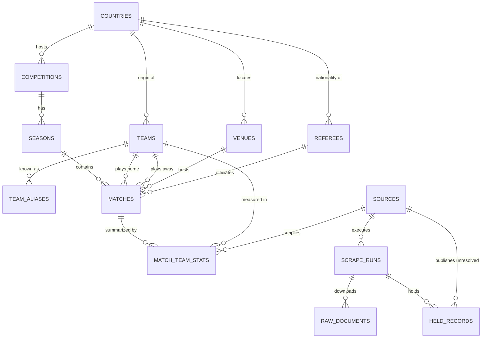

# Entity Model

This model describes increment 1, Match History. The entities of later increments are
declared in `docs/vision.md` and enter this model in the pass that opens their increment.

## Entity Relationship Diagram

### COUNTRIES

Countries and territories used to classify teams, competitions, venues and referees.

| Attribute     | Description                                        | Data Type | Length/Precision | Validation Rules                                          |
|---------------|----------------------------------------------------|-----------|------------------|-----------------------------------------------------------|
| id            | Unique identifier of the country                   | Long      | 19               | Primary Key, Sequence                                     |
| name          | Official name of the country                       | String    | 100              | Not Null, Unique                                          |
| fifa_code     | Three letter code of the national football association | String | 3               | Not Null, Unique                                          |
| confederation | Football confederation the country belongs to      | String    | 20               | Not Null, Values: UEFA, CONMEBOL, CONCACAF, CAF, AFC, OFC |

### TEAMS

Clubs and national sides, each holding the canonical name used across the system.

| Attribute        | Description                                          | Data Type | Length/Precision | Validation Rules      |
|------------------|------------------------------------------------------|-----------|------------------|-----------------------|
| id               | Unique identifier of the team                        | Long      | 19               | Primary Key, Sequence |
| name             | Canonical name of the team                           | String    | 100              | Not Null              |
| short_name       | Abbreviated name used for display                    | String    | 50               | Optional              |
| country_id       | Country of the team, referencing COUNTRIES           | Long      | 19               | Optional              |
| founded_year     | Year the club was founded                            | Integer   | 10               | Optional              |
| is_national_team | Whether the team is a national side                  | Boolean   | 1                | Not Null              |
| created_at       | Moment the record was created in the system          | DateTime  | -                | Not Null              |

### TEAM_ALIASES

Alternative names by which external sources refer to the same team.

| Attribute  | Description                                                  | Data Type | Length/Precision | Validation Rules                 |
|------------|--------------------------------------------------------------|-----------|------------------|----------------------------------|
| id         | Unique identifier of the alias                               | Long      | 19               | Primary Key, Sequence            |
| team_id    | Team the alias refers to                                     | Long      | 19               | Not Null, Foreign Key (TEAMS.id) |
| alias      | Alternative name exactly as published by the source          | String    | 100              | Not Null                         |
| normalized | Alias lowercased, without accents or corporate suffixes      | String    | 100              | Not Null                         |

**Constraints:** The combination of normalized alias and team must be unique.

### VENUES

Stadiums where matches are played, with their geographic location.

| Attribute  | Description                                     | Data Type | Length/Precision | Validation Rules      |
|------------|-------------------------------------------------|-----------|------------------|-----------------------|
| id         | Unique identifier of the venue                  | Long      | 19               | Primary Key, Sequence |
| name       | Name of the stadium                             | String    | 100              | Not Null              |
| city       | City where the stadium is located               | String    | 100              | Optional              |
| country_id | Country of the venue, referencing COUNTRIES     | Long      | 19               | Optional              |
| capacity   | Maximum spectator capacity                      | Integer   | 10               | Optional              |
| latitude   | Geographic latitude in decimal degrees          | Decimal   | 9,6              | Optional              |
| longitude  | Geographic longitude in decimal degrees         | Decimal   | 9,6              | Optional              |
| altitude_m | Height above sea level in metres                | Integer   | 10               | Optional              |

### REFEREES

Head referees who officiate matches.

| Attribute  | Description                                            | Data Type | Length/Precision | Validation Rules      |
|------------|--------------------------------------------------------|-----------|------------------|-----------------------|
| id         | Unique identifier of the referee                       | Long      | 19               | Primary Key, Sequence |
| name       | Full name of the referee                               | String    | 100              | Not Null              |
| country_id | Nationality of the referee, referencing COUNTRIES      | Long      | 19               | Optional              |

### COMPETITIONS

Football tournaments, covering domestic leagues, cups and continental competitions.

| Attribute     | Description                                                          | Data Type | Length/Precision | Validation Rules                                       |
|---------------|----------------------------------------------------------------------|-----------|------------------|--------------------------------------------------------|
| id            | Unique identifier of the competition                                 | Long      | 19               | Primary Key, Sequence                                  |
| name          | Official name of the competition                                     | String    | 100              | Not Null                                               |
| format        | Way the competition is contested                                     | String    | 20               | Not Null, Values: league, cup, group_knockout           |
| scope         | Territorial reach of the competition                                 | String    | 20               | Not Null, Values: domestic, continental, international  |
| country_id    | Organising country, empty for continental competitions               | Long      | 19               | Optional                                               |
| confederation | Confederation that organises the competition                         | String    | 20               | Optional                                               |
| tier          | Level in the national pyramid, where one is the top division         | Integer   | 10               | Optional                                               |
| gender        | Gender category of the competition                                   | String    | 10               | Not Null, Values: male, female                         |
| is_collected  | Whether the system currently collects this competition               | Boolean   | 1                | Not Null                                               |

**Constraints:** The combination of name and organising country must be unique. A competition withdrawn from collection keeps every season, match and statistic already gathered for it.

### SEASONS

Annual editions of a competition, each with its own window of play.

| Attribute      | Description                                              | Data Type | Length/Precision | Validation Rules                        |
|----------------|----------------------------------------------------------|-----------|------------------|-----------------------------------------|
| id             | Unique identifier of the season                          | Long      | 19               | Primary Key, Sequence                   |
| competition_id | Competition the season belongs to                        | Long      | 19               | Not Null, Foreign Key (COMPETITIONS.id) |
| label          | Human readable label of the season                       | String    | 20               | Not Null                                |
| year_start     | Calendar year in which the season begins                 | Integer   | 10               | Not Null                                |
| start_date     | Date of the first match of the season                    | Date      | -                | Optional                                |
| end_date       | Date of the last match of the season                     | Date      | -                | Optional                                |
| num_teams      | Number of participating teams                            | Integer   | 10               | Optional                                |
| is_current     | Whether the season is currently being played             | Boolean   | 1                | Not Null                                |

**Constraints:** The combination of competition and label must be unique. The end date must be later than the start date.

### MATCHES

Fixtures between two teams within a season, whether scheduled or already played.

| Attribute       | Description                                                          | Data Type | Length/Precision | Validation Rules                                                  |
|-----------------|----------------------------------------------------------------------|-----------|------------------|-------------------------------------------------------------------|
| id              | Unique identifier of the match                                       | Long      | 19               | Primary Key, Sequence                                             |
| season_id       | Season the match belongs to                                          | Long      | 19               | Not Null, Foreign Key (SEASONS.id)                                |
| home_team_id    | Team playing at home                                                 | Long      | 19               | Not Null, Foreign Key (TEAMS.id)                                  |
| away_team_id    | Team playing away                                                    | Long      | 19               | Not Null, Foreign Key (TEAMS.id)                                  |
| venue_id        | Stadium hosting the match, referencing VENUES                        | Long      | 19               | Optional                                                          |
| referee_id      | Head referee of the match, referencing REFEREES                      | Long      | 19               | Optional                                                          |
| kickoff_utc     | Moment the match starts, expressed in universal time                 | DateTime  | -                | Not Null                                                          |
| local_date      | Match date in the time zone of the venue                             | Date      | -                | Not Null                                                          |
| stage           | Stage of the tournament in which the match is played                 | String    | 30               | Optional                                                          |
| round           | Matchday or round within the stage                                   | String    | 30               | Optional                                                          |
| status          | Current state of the match                                           | String    | 20               | Not Null, Values: scheduled, live, finished, postponed, cancelled |
| neutral_venue   | Whether the match is played on neutral ground                        | Boolean   | 1                | Not Null                                                          |
| home_score      | Home goals at the end of regular time                                | Integer   | 10               | Optional                                                          |
| away_score      | Away goals at the end of regular time                                | Integer   | 10               | Optional                                                          |
| home_score_ht   | Home goals at half time                                              | Integer   | 10               | Optional                                                          |
| away_score_ht   | Away goals at half time                                              | Integer   | 10               | Optional                                                          |
| home_score_et   | Home goals after extra time                                          | Integer   | 10               | Optional                                                          |
| away_score_et   | Away goals after extra time                                          | Integer   | 10               | Optional                                                          |
| home_pens       | Penalties converted by the home team in the shootout                 | Integer   | 10               | Optional                                                          |
| away_pens       | Penalties converted by the away team in the shootout                 | Integer   | 10               | Optional                                                          |
| attendance      | Spectators present at the stadium                                    | Integer   | 10               | Optional                                                          |
| created_at      | Moment the record was created in the system                          | DateTime  | -                | Not Null                                                          |
| updated_at      | Moment the record was last modified                                  | DateTime  | -                | Not Null                                                          |
| last_scraped_at | Moment data for the match was last collected                         | DateTime  | -                | Optional                                                          |

**Constraints:** The home team and the away team must be different. A match in status finished must have both home and away scores populated. Extra time scores may only be populated when regular time scores exist.

### MATCH_TEAM_STATS

Aggregated statistics of one team in one match, as reported by a given source.

| Attribute       | Description                                     | Data Type | Length/Precision | Validation Rules                   |
|-----------------|-------------------------------------------------|-----------|------------------|------------------------------------|
| id              | Unique identifier of the statistics record      | Long      | 19               | Primary Key, Sequence              |
| match_id        | Match the statistics belong to                  | Long      | 19               | Not Null, Foreign Key (MATCHES.id) |
| team_id         | Team the statistics belong to                   | Long      | 19               | Not Null, Foreign Key (TEAMS.id)   |
| source_id       | Source the data was collected from              | Long      | 19               | Not Null, Foreign Key (SOURCES.id) |
| is_home         | Whether the team played at home in this match   | Boolean   | 1                | Not Null                           |
| shots           | Total shots attempted                           | Integer   | 10               | Optional                           |
| shots_on_target | Shots aimed within the frame of the goal        | Integer   | 10               | Optional                           |
| woodwork        | Shots that struck the post or the crossbar      | Integer   | 10               | Optional                           |
| corners         | Corner kicks won                                | Integer   | 10               | Optional                           |
| offsides        | Offsides called against the team                | Integer   | 10               | Optional                           |
| fouls           | Fouls committed                                 | Integer   | 10               | Optional                           |
| yellow_cards    | Yellow cards received                           | Integer   | 10               | Optional                           |
| red_cards       | Red cards received                              | Integer   | 10               | Optional                           |

**Constraints:** The combination of match, team and source must be unique. Each match accepts at most two teams per source, which must be the home and away teams of that match.

### SOURCES

Catalogue of external data providers that feed the system.

| Attribute     | Description                                                    | Data Type | Length/Precision | Validation Rules      |
|---------------|----------------------------------------------------------------|-----------|------------------|-----------------------|
| id            | Unique identifier of the source                                | Long      | 19               | Primary Key, Sequence |
| slug          | Technical identifier of the source                             | String    | 50               | Not Null, Unique      |
| name          | Commercial name of the source                                  | String    | 100              | Not Null              |
| base_url      | Root address from which data is collected                      | String    | 200              | Not Null              |
| rate_limit_ms | Minimum wait in milliseconds between consecutive requests      | Integer   | 10               | Not Null              |
| rate_limit_is_assumed | Whether that wait was assumed by the system rather than stated by the source | Boolean | 1     | Not Null              |
| is_active     | Whether the source is currently being collected                | Boolean   | 1                | Not Null              |

### SCRAPE_RUNS

A single execution of a collection process against one source.

| Attribute      | Description                                                  | Data Type | Length/Precision | Validation Rules                               |
|----------------|--------------------------------------------------------------|-----------|------------------|------------------------------------------------|
| id             | Unique identifier of the run                                 | Long      | 19               | Primary Key, Sequence                          |
| source_id      | Source the collection runs against                           | Long      | 19               | Not Null, Foreign Key (SOURCES.id)             |
| target         | Description of the batch of data requested                   | String    | 200              | Not Null                                       |
| started_at     | Moment the run began                                         | DateTime  | -                | Not Null                                       |
| finished_at    | Moment the run ended                                         | DateTime  | -                | Optional                                       |
| status         | Outcome of the run                                           | String    | 20               | Not Null, Values: running, ok, failed, partial, abandoned |
| items_found    | Number of items located at the source                        | Integer   | 10               | Optional                                       |
| items_upserted | Number of items inserted or updated in the database          | Integer   | 10               | Optional                                       |
| items_failed   | Number of items abandoned after exhausting their attempts    | Integer   | 10               | Optional                                       |
| resume_point   | Reference to the last item processed, from which an interrupted run continues | String | 200 | Optional                       |
| error          | Detail of the failure when the run does not complete cleanly | String    | 2000             | Optional                                       |

**Constraints:** The finish moment must be later than the start moment. A run in status running may not have a finish moment. At most one run per source and target may hold status running at any moment. A run in status partial must carry a resume point.

### RAW_DOCUMENTS

Verbatim copy of every document downloaded from a source, kept for reprocessing.

| Attribute     | Description                                                   | Data Type | Length/Precision | Validation Rules                       |
|---------------|---------------------------------------------------------------|-----------|------------------|----------------------------------------|
| id            | Unique identifier of the document                             | Long      | 19               | Primary Key, Sequence                  |
| scrape_run_id | Collection run that downloaded the document                   | Long      | 19               | Not Null, Foreign Key (SCRAPE_RUNS.id) |
| url           | Address the document was downloaded from                      | String    | 500              | Not Null                               |
| content_hash  | Digest of the content, used to avoid reprocessing duplicates  | String    | 64               | Not Null, Unique                       |
| status_code   | Response code returned by the server                          | Integer   | 10               | Not Null                               |
| payload       | Full content of the document exactly as received              | String    | 1000000          | Not Null                               |
| attempts      | Number of attempts made before the document was obtained      | Integer   | 10               | Not Null                               |
| fetched_at    | Moment the document was downloaded                            | DateTime  | -                | Not Null                               |
| parsed_at     | Moment the document was successfully parsed                   | DateTime  | -                | Optional                               |
| reading_version | Version of the interpretation applied the last time the document was parsed | String | 20      | Optional                               |
| parse_error   | Detail of the failure raised while parsing the document       | String    | 2000             | Optional                               |

**Constraints:** A document carrying a parsed moment must also carry the reading version used. Attempts may not exceed the retry limit the collection policy allows.

### HELD_RECORDS

A published value that could not be confidently bound to a known entity and is waiting for a person to resolve it.

| Attribute       | Description                                                                  | Data Type | Length/Precision | Validation Rules                            |
|-----------------|------------------------------------------------------------------------------|-----------|------------------|---------------------------------------------|
| id              | Unique identifier of the held record                                         | Long      | 19               | Primary Key, Sequence                       |
| scrape_run_id   | Collection run that held the record                                          | Long      | 19               | Not Null, Foreign Key (SCRAPE_RUNS.id)      |
| source_id       | Source that published the value                                              | Long      | 19               | Not Null, Foreign Key (SOURCES.id)          |
| held_kind       | Kind of entity the value was meant to name                                   | String    | 20               | Not Null, Values: team                      |
| published_value | The name or reference exactly as the source published it                     | String    | 200              | Not Null                                    |
| context         | Where the value appeared, so a reviewer can judge it                         | String    | 500              | Optional                                    |
| candidates      | The known entities considered and how closely each matched                   | String    | 2000             | Optional                                    |
| status          | Whether the record is still waiting, was resolved, or was discarded          | String    | 20               | Not Null, Values: pending, resolved, discarded |
| resolved_ref    | Identifier of the entity the value was finally bound to, a team while team is the only held kind | Long | 19          | Optional                                    |
| held_at         | Moment the record was held                                                   | DateTime  | -                | Not Null                                    |
| resolved_at     | Moment a person resolved or discarded the record                             | DateTime  | -                | Optional                                    |

**Constraints:** The combination of source, held kind and published value must be unique while the status is pending. A record in status resolved must carry both a resolved reference and a resolved moment, and a record in status pending must carry neither. The resolved reference names an entity of the held kind, which is a team while team is the only kind held.
