# Entity Model

## Entity Relationship Diagram

```mermaid
erDiagram
    COUNTRIES ||--o{ TEAMS : "origin of"
    COUNTRIES ||--o{ COMPETITIONS : "hosts"
    COUNTRIES ||--o{ VENUES : "locates"
    COUNTRIES ||--o{ REFEREES : "nationality of"
    COUNTRIES ||--o{ PLAYERS : "nationality of"
    TEAMS ||--o{ TEAM_ALIASES : "known as"
    COMPETITIONS ||--o{ SEASONS : "has"
    SEASONS ||--o{ SEASON_TEAMS : "enrolls"
    TEAMS ||--o{ SEASON_TEAMS : "participates in"
    SEASONS ||--o{ MATCHES : "contains"
    TEAMS ||--o{ MATCHES : "plays home"
    TEAMS ||--o{ MATCHES : "plays away"
    VENUES ||--o{ MATCHES : "hosts"
    REFEREES ||--o{ MATCHES : "officiates"
    MATCHES ||--o| MATCH_WEATHER : "records"
    MATCHES ||--o{ MATCH_TEAM_STATS : "summarized by"
    TEAMS ||--o{ MATCH_TEAM_STATS : "measured in"
    SOURCES ||--o{ MATCH_TEAM_STATS : "supplies"
    SOURCES ||--o{ SCRAPE_RUNS : "executes"
    SCRAPE_RUNS ||--o{ RAW_DOCUMENTS : "downloads"
    SCRAPE_RUNS ||--o{ HELD_RECORDS : "holds"
    SOURCES ||--o{ HELD_RECORDS : "publishes unresolved"
    SOURCES ||--o{ SOURCE_COVERAGE : "offers"
    COMPETITIONS ||--o{ SOURCE_COVERAGE : "described by"
    SOURCES ||--o{ TEAM_SOURCES : "identifies"
    TEAMS ||--o{ TEAM_SOURCES : "mapped in"
    SOURCES ||--o{ MATCH_SOURCES : "identifies"
    MATCHES ||--o{ MATCH_SOURCES : "mapped in"
    SOURCES ||--o{ COMPETITION_SOURCES : "identifies"
    COMPETITIONS ||--o{ COMPETITION_SOURCES : "mapped in"
    BOOKMAKERS ||--o{ MATCH_ODDS : "quotes"
    MATCHES ||--o{ MATCH_ODDS : "priced by"
    MATCHES ||--o{ MATCH_FEATURES : "generates"
    TEAMS ||--o{ MATCH_FEATURES : "perspective of"
    MATCHES ||--o{ PREDICTIONS : "forecast by"
    MODELS ||--o{ PREDICTIONS : "produces"
    PLAYERS ||--o{ PLAYER_TEAM_SPELLS : "signs"
    TEAMS ||--o{ PLAYER_TEAM_SPELLS : "employs"
    MATCHES ||--o{ LINEUPS : "fields"
    TEAMS ||--o{ LINEUPS : "selects"
    PLAYERS ||--o{ LINEUPS : "appears in"
    MATCHES ||--o{ MATCH_EVENTS : "records"
    TEAMS ||--o{ MATCH_EVENTS : "performs"
    PLAYERS ||--o{ MATCH_EVENTS : "involved in"
    MATCHES ||--o{ PLAYER_MATCH_STATS : "details"
    PLAYERS ||--o{ PLAYER_MATCH_STATS : "performs in"
    PLAYERS ||--o{ PLAYER_AVAILABILITY : "unavailable in"
    TEAMS ||--o{ PLAYER_AVAILABILITY : "misses"
    MATCHES ||--o{ SHOTS : "contains"
    TEAMS ||--o{ SHOTS : "attempts"
    PLAYERS ||--o{ SHOTS : "takes"
```

### COUNTRIES

Countries and territories used to classify teams, competitions, venues, referees and players.

| Attribute     | Description                                        | Data Type | Length/Precision | Validation Rules                                          |
|---------------|----------------------------------------------------|-----------|------------------|-----------------------------------------------------------|
| id            | Unique identifier of the country                   | Long      | 19               | Primary Key, Sequence                                     |
| name          | Official name of the country                       | String    | 100              | Not Null, Unique                                          |
| iso3          | Three letter ISO country code                      | String    | 3                | Not Null, Unique                                          |
| confederation | Football confederation the country belongs to      | String    | 20               | Not Null, Values: UEFA, CONMEBOL, CONCACAF, CAF, AFC, OFC |

### TEAMS

Clubs and national sides, each holding the canonical name used across the system.

| Attribute        | Description                                          | Data Type | Length/Precision | Validation Rules      |
|------------------|------------------------------------------------------|-----------|------------------|-----------------------|
| id               | Unique identifier of the team                        | Long      | 19               | Primary Key, Sequence |
| name             | Canonical name of the team                           | String    | 100              | Not Null              |
| short_name       | Abbreviated name used for display                    | String    | 50               | Optional              |
| country_id       | Country of the team, referencing COUNTRIES           | Long      | 19               | Optional              |
| founded_year     | Year the club was founded                            | Integer   | 10               | Optional              |
| is_national_team | Whether the team is a national side                  | Boolean   | 1                | Not Null              |
| created_at       | Moment the record was created in the system          | DateTime  | -                | Not Null              |

### TEAM_ALIASES

Alternative names by which external sources refer to the same team.

| Attribute  | Description                                                  | Data Type | Length/Precision | Validation Rules                 |
|------------|--------------------------------------------------------------|-----------|------------------|----------------------------------|
| id         | Unique identifier of the alias                               | Long      | 19               | Primary Key, Sequence            |
| team_id    | Team the alias refers to                                     | Long      | 19               | Not Null, Foreign Key (TEAMS.id) |
| alias      | Alternative name exactly as published by the source          | String    | 100              | Not Null                         |
| normalized | Alias lowercased, without accents or corporate suffixes      | String    | 100              | Not Null                         |

**Constraints:** The combination of normalized alias and team must be unique.

### VENUES

Stadiums where matches are played, with their geographic location.

| Attribute  | Description                                     | Data Type | Length/Precision | Validation Rules      |
|------------|-------------------------------------------------|-----------|------------------|-----------------------|
| id         | Unique identifier of the venue                  | Long      | 19               | Primary Key, Sequence |
| name       | Name of the stadium                             | String    | 100              | Not Null              |
| city       | City where the stadium is located               | String    | 100              | Optional              |
| country_id | Country of the venue, referencing COUNTRIES     | Long      | 19               | Optional              |
| capacity   | Maximum spectator capacity                      | Integer   | 10               | Optional              |
| latitude   | Geographic latitude in decimal degrees          | Decimal   | 9,6              | Optional              |
| longitude  | Geographic longitude in decimal degrees         | Decimal   | 9,6              | Optional              |
| altitude_m | Height above sea level in metres                | Integer   | 10               | Optional              |

### REFEREES

Head referees who officiate matches.

| Attribute  | Description                                            | Data Type | Length/Precision | Validation Rules      |
|------------|--------------------------------------------------------|-----------|------------------|-----------------------|
| id         | Unique identifier of the referee                       | Long      | 19               | Primary Key, Sequence |
| name       | Full name of the referee                               | String    | 100              | Not Null              |
| country_id | Nationality of the referee, referencing COUNTRIES      | Long      | 19               | Optional              |

### COMPETITIONS

Football tournaments, covering domestic leagues, cups and continental competitions.

| Attribute     | Description                                                          | Data Type | Length/Precision | Validation Rules                                       |
|---------------|----------------------------------------------------------------------|-----------|------------------|--------------------------------------------------------|
| id            | Unique identifier of the competition                                 | Long      | 19               | Primary Key, Sequence                                  |
| name          | Official name of the competition                                     | String    | 100              | Not Null                                               |
| format        | Way the competition is contested                                     | String    | 20               | Not Null, Values: league, cup, group_knockout           |
| scope         | Territorial reach of the competition                                 | String    | 20               | Not Null, Values: domestic, continental, international  |
| country_id    | Organising country, empty for continental competitions               | Long      | 19               | Optional                                               |
| confederation | Confederation that organises the competition                         | String    | 20               | Optional                                               |
| tier          | Level in the national pyramid, where one is the top division         | Integer   | 10               | Optional                                               |
| gender        | Gender category of the competition                                   | String    | 10               | Not Null, Values: male, female                         |

### SEASONS

Annual editions of a competition, each with its own window of play.

| Attribute      | Description                                              | Data Type | Length/Precision | Validation Rules                        |
|----------------|----------------------------------------------------------|-----------|------------------|-----------------------------------------|
| id             | Unique identifier of the season                          | Long      | 19               | Primary Key, Sequence                   |
| competition_id | Competition the season belongs to                        | Long      | 19               | Not Null, Foreign Key (COMPETITIONS.id) |
| label          | Human readable label of the season                       | String    | 20               | Not Null                                |
| year_start     | Calendar year in which the season begins                 | Integer   | 10               | Not Null                                |
| start_date     | Date of the first match of the season                    | Date      | -                | Optional                                |
| end_date       | Date of the last match of the season                     | Date      | -                | Optional                                |
| num_teams      | Number of participating teams                            | Integer   | 10               | Optional                                |
| is_current     | Whether the season is currently being played             | Boolean   | 1                | Not Null                                |

**Constraints:** The combination of competition and label must be unique. The end date must be later than the start date.

### SEASON_TEAMS

Enrolment of a team in a given season, together with its final standing.

| Attribute      | Description                                      | Data Type | Length/Precision | Validation Rules                   |
|----------------|--------------------------------------------------|-----------|------------------|------------------------------------|
| id             | Unique identifier of the enrolment                | Long      | 19               | Primary Key, Sequence              |
| season_id      | Season the team takes part in                    | Long      | 19               | Not Null, Foreign Key (SEASONS.id) |
| team_id        | Team enrolled in the season                      | Long      | 19               | Not Null, Foreign Key (TEAMS.id)   |
| final_position | Final position in the standings                  | Integer   | 10               | Optional                           |
| points         | Total points obtained during the season          | Integer   | 10               | Optional                           |

**Constraints:** The combination of season and team must be unique.

### MATCHES

Fixtures between two teams within a season, whether scheduled or already played.

| Attribute       | Description                                                          | Data Type | Length/Precision | Validation Rules                                                  |
|-----------------|----------------------------------------------------------------------|-----------|------------------|-------------------------------------------------------------------|
| id              | Unique identifier of the match                                       | Long      | 19               | Primary Key, Sequence                                             |
| season_id       | Season the match belongs to                                          | Long      | 19               | Not Null, Foreign Key (SEASONS.id)                                |
| home_team_id    | Team playing at home                                                 | Long      | 19               | Not Null, Foreign Key (TEAMS.id)                                  |
| away_team_id    | Team playing away                                                    | Long      | 19               | Not Null, Foreign Key (TEAMS.id)                                  |
| venue_id        | Stadium hosting the match, referencing VENUES                        | Long      | 19               | Optional                                                          |
| referee_id      | Head referee of the match, referencing REFEREES                      | Long      | 19               | Optional                                                          |
| kickoff_utc     | Moment the match starts, expressed in universal time                 | DateTime  | -                | Not Null                                                          |
| local_date      | Match date in the time zone of the venue                             | Date      | -                | Not Null                                                          |
| stage           | Stage of the tournament in which the match is played                 | String    | 30               | Optional                                                          |
| round           | Matchday or round within the stage                                   | String    | 30               | Optional                                                          |
| status          | Current state of the match                                           | String    | 20               | Not Null, Values: scheduled, live, finished, postponed, cancelled |
| neutral_venue   | Whether the match is played on neutral ground                        | Boolean   | 1                | Not Null                                                          |
| home_score      | Home goals at the end of regular time                                | Integer   | 10               | Optional                                                          |
| away_score      | Away goals at the end of regular time                                | Integer   | 10               | Optional                                                          |
| home_score_ht   | Home goals at half time                                              | Integer   | 10               | Optional                                                          |
| away_score_ht   | Away goals at half time                                              | Integer   | 10               | Optional                                                          |
| home_score_et   | Home goals after extra time                                          | Integer   | 10               | Optional                                                          |
| away_score_et   | Away goals after extra time                                          | Integer   | 10               | Optional                                                          |
| home_pens       | Penalties converted by the home team in the shootout                 | Integer   | 10               | Optional                                                          |
| away_pens       | Penalties converted by the away team in the shootout                 | Integer   | 10               | Optional                                                          |
| attendance      | Spectators present at the stadium                                    | Integer   | 10               | Optional                                                          |
| created_at      | Moment the record was created in the system                          | DateTime  | -                | Not Null                                                          |
| updated_at      | Moment the record was last modified                                  | DateTime  | -                | Not Null                                                          |
| last_scraped_at | Moment data for the match was last collected                         | DateTime  | -                | Optional                                                          |

**Constraints:** The home team and the away team must be different. A match in status finished must have both home and away scores populated. Extra time scores may only be populated when regular time scores exist.

### MATCH_WEATHER

Weather conditions recorded at the venue at the kickoff time of a match.

| Attribute        | Description                                        | Data Type | Length/Precision | Validation Rules                   |
|------------------|----------------------------------------------------|-----------|------------------|------------------------------------|
| id               | Unique identifier of the weather record            | Long      | 19               | Primary Key, Sequence              |
| match_id         | Match the conditions belong to                     | Long      | 19               | Not Null, Foreign Key (MATCHES.id) |
| temperature_c    | Air temperature in degrees Celsius                 | Decimal   | 10,2             | Optional                           |
| humidity         | Relative humidity as a percentage                  | Decimal   | 10,2             | Optional                           |
| wind_kmh         | Wind speed in kilometres per hour                  | Decimal   | 10,2             | Optional                           |
| precipitation_mm | Accumulated precipitation in millimetres           | Decimal   | 10,2             | Optional                           |
| condition        | Qualitative description of the sky                 | String    | 50               | Optional                           |

**Constraints:** Each match accepts at most one weather record.

### MATCH_TEAM_STATS

Aggregated statistics of one team in one match, as reported by a given source.

| Attribute          | Description                                                | Data Type | Length/Precision | Validation Rules                   |
|--------------------|------------------------------------------------------------|-----------|------------------|------------------------------------|
| id                 | Unique identifier of the statistics record                 | Long      | 19               | Primary Key, Sequence              |
| match_id           | Match the statistics belong to                             | Long      | 19               | Not Null, Foreign Key (MATCHES.id) |
| team_id            | Team the statistics belong to                              | Long      | 19               | Not Null, Foreign Key (TEAMS.id)   |
| source_id          | Source the data was collected from                         | Long      | 19               | Not Null, Foreign Key (SOURCES.id) |
| is_home            | Whether the team played at home in this match              | Boolean   | 1                | Not Null                           |
| xg                 | Expected goals generated by the team                       | Decimal   | 10,3             | Optional                           |
| xg_non_penalty     | Expected goals excluding penalties                         | Decimal   | 10,3             | Optional                           |
| shots              | Total shots attempted                                      | Integer   | 10               | Optional                           |
| shots_on_target    | Shots aimed within the frame of the goal                   | Integer   | 10               | Optional                           |
| shots_off_target   | Shots sent wide of the goal                                | Integer   | 10               | Optional                           |
| shots_blocked      | Shots blocked by a defender                                | Integer   | 10               | Optional                           |
| shots_inside_box   | Shots attempted from inside the penalty area               | Integer   | 10               | Optional                           |
| big_chances        | Clear goalscoring opportunities created                    | Integer   | 10               | Optional                           |
| big_chances_missed | Clear goalscoring opportunities missed                     | Integer   | 10               | Optional                           |
| woodwork           | Shots that struck the post or the crossbar                 | Integer   | 10               | Optional                           |
| possession         | Share of ball possession as a percentage                   | Decimal   | 10,2             | Optional                           |
| passes             | Passes attempted                                           | Integer   | 10               | Optional                           |
| passes_completed   | Passes successfully completed                              | Integer   | 10               | Optional                           |
| crosses            | Crosses delivered into the area                            | Integer   | 10               | Optional                           |
| corners            | Corner kicks won                                           | Integer   | 10               | Optional                           |
| offsides           | Offsides called against the team                           | Integer   | 10               | Optional                           |
| fouls              | Fouls committed                                            | Integer   | 10               | Optional                           |
| yellow_cards       | Yellow cards received                                      | Integer   | 10               | Optional                           |
| red_cards          | Red cards received                                         | Integer   | 10               | Optional                           |
| tackles            | Defensive tackles made                                     | Integer   | 10               | Optional                           |
| interceptions      | Interceptions made                                         | Integer   | 10               | Optional                           |
| clearances         | Clearances made                                            | Integer   | 10               | Optional                           |
| saves              | Saves made by the goalkeeper                               | Integer   | 10               | Optional                           |
| duels_won          | Individual duels won                                       | Integer   | 10               | Optional                           |
| aerials_won        | Aerial duels won                                           | Integer   | 10               | Optional                           |

**Constraints:** The combination of match, team and source must be unique. Each match accepts at most two teams per source, which must be the home and away teams of that match. Completed passes may not exceed attempted passes.

### SOURCES

Catalogue of external data providers that feed the system.

| Attribute     | Description                                                    | Data Type | Length/Precision | Validation Rules      |
|---------------|----------------------------------------------------------------|-----------|------------------|-----------------------|
| id            | Unique identifier of the source                                | Long      | 19               | Primary Key, Sequence |
| slug          | Technical identifier of the source                             | String    | 50               | Not Null, Unique      |
| name          | Commercial name of the source                                  | String    | 100              | Not Null              |
| base_url      | Root address from which data is collected                      | String    | 200              | Not Null              |
| rate_limit_ms | Minimum wait in milliseconds between consecutive requests      | Integer   | 10               | Not Null              |
| is_active     | Whether the source is currently being collected                | Boolean   | 1                | Not Null              |

### SCRAPE_RUNS

A single execution of a collection process against one source.

| Attribute      | Description                                                  | Data Type | Length/Precision | Validation Rules                               |
|----------------|--------------------------------------------------------------|-----------|------------------|------------------------------------------------|
| id             | Unique identifier of the run                                 | Long      | 19               | Primary Key, Sequence                          |
| source_id      | Source the collection runs against                           | Long      | 19               | Not Null, Foreign Key (SOURCES.id)             |
| target         | Description of the batch of data requested                   | String    | 200              | Not Null                                       |
| started_at     | Moment the run began                                         | DateTime  | -                | Not Null                                       |
| finished_at    | Moment the run ended                                         | DateTime  | -                | Optional                                       |
| status         | Outcome of the run                                           | String    | 20               | Not Null, Values: running, ok, failed, partial, abandoned |
| items_found    | Number of items located at the source                        | Integer   | 10               | Optional                                       |
| items_upserted | Number of items inserted or updated in the database          | Integer   | 10               | Optional                                       |
| items_failed   | Number of items abandoned after exhausting their attempts    | Integer   | 10               | Optional                                       |
| resume_point   | Reference to the last item processed, from which an interrupted run continues | String | 200 | Optional                       |
| error          | Detail of the failure when the run does not complete cleanly | String    | 2000             | Optional                                       |

**Constraints:** The finish moment must be later than the start moment. A run in status running may not have a finish moment. At most one run per source and target may hold status running at any moment. A run in status partial must carry a resume point.

### RAW_DOCUMENTS

Verbatim copy of every document downloaded from a source, kept for reprocessing.

| Attribute     | Description                                                   | Data Type | Length/Precision | Validation Rules                       |
|---------------|---------------------------------------------------------------|-----------|------------------|----------------------------------------|
| id            | Unique identifier of the document                             | Long      | 19               | Primary Key, Sequence                  |
| scrape_run_id | Collection run that downloaded the document                   | Long      | 19               | Not Null, Foreign Key (SCRAPE_RUNS.id) |
| url           | Address the document was downloaded from                      | String    | 500              | Not Null                               |
| content_hash  | Digest of the content, used to avoid reprocessing duplicates  | String    | 64               | Not Null, Unique                       |
| status_code   | Response code returned by the server                          | Integer   | 10               | Not Null                               |
| payload       | Full content of the document exactly as received              | String    | 1000000          | Not Null                               |
| attempts      | Number of attempts made before the document was obtained      | Integer   | 10               | Not Null                               |
| fetched_at    | Moment the document was downloaded                            | DateTime  | -                | Not Null                               |
| parsed_at     | Moment the document was successfully parsed                   | DateTime  | -                | Optional                               |
| reading_version | Version of the interpretation applied the last time the document was parsed | String | 20      | Optional                               |
| parse_error   | Detail of the failure raised while parsing the document       | String    | 2000             | Optional                               |

**Constraints:** A document carrying a parsed moment must also carry the reading version used. Attempts may not exceed the retry limit the collection policy allows.

### TEAM_SOURCES

Correspondence between a team in the system and the identifier a source assigns to it.

| Attribute     | Description                                              | Data Type | Length/Precision | Validation Rules                   |
|---------------|----------------------------------------------------------|-----------|------------------|------------------------------------|
| id            | Unique identifier of the correspondence                  | Long      | 19               | Primary Key, Sequence              |
| team_id       | Team in the system the correspondence points to          | Long      | 19               | Not Null, Foreign Key (TEAMS.id)   |
| source_id     | Source that assigns the external identifier              | Long      | 19               | Not Null, Foreign Key (SOURCES.id) |
| external_id   | Identifier of the team within the source                 | String    | 100              | Not Null                           |
| external_name | Name of the team exactly as published by the source      | String    | 200              | Optional                           |

**Constraints:** The combination of source and external identifier must be unique.

### MATCH_SOURCES

Correspondence between a match in the system and the identifier a source assigns to it.

| Attribute   | Description                                          | Data Type | Length/Precision | Validation Rules                   |
|-------------|------------------------------------------------------|-----------|------------------|------------------------------------|
| id          | Unique identifier of the correspondence              | Long      | 19               | Primary Key, Sequence              |
| match_id    | Match in the system the correspondence points to     | Long      | 19               | Not Null, Foreign Key (MATCHES.id) |
| source_id   | Source that assigns the external identifier          | Long      | 19               | Not Null, Foreign Key (SOURCES.id) |
| external_id | Identifier of the match within the source            | String    | 100              | Not Null                           |
| url         | Address of the match page at the source              | String    | 500              | Optional                           |

**Constraints:** The combination of source and external identifier must be unique.

### COMPETITION_SOURCES

Correspondence between a competition in the system and the identifier a source assigns to it.

| Attribute      | Description                                                | Data Type | Length/Precision | Validation Rules                        |
|----------------|------------------------------------------------------------|-----------|------------------|-----------------------------------------|
| id             | Unique identifier of the correspondence                    | Long      | 19               | Primary Key, Sequence                   |
| competition_id | Competition in the system the correspondence points to     | Long      | 19               | Not Null, Foreign Key (COMPETITIONS.id) |
| source_id      | Source that assigns the external identifier                | Long      | 19               | Not Null, Foreign Key (SOURCES.id)      |
| external_id    | Identifier of the competition within the source            | String    | 100              | Not Null                                |

**Constraints:** The combination of source and external identifier must be unique.

### HELD_RECORDS

A published value that could not be confidently bound to a known entity and is waiting for a person to resolve it.

| Attribute       | Description                                                                  | Data Type | Length/Precision | Validation Rules                            |
|-----------------|------------------------------------------------------------------------------|-----------|------------------|---------------------------------------------|
| id              | Unique identifier of the held record                                         | Long      | 19               | Primary Key, Sequence                       |
| scrape_run_id   | Collection run that held the record                                          | Long      | 19               | Not Null, Foreign Key (SCRAPE_RUNS.id)      |
| source_id       | Source that published the value                                              | Long      | 19               | Not Null, Foreign Key (SOURCES.id)          |
| held_kind       | Kind of entity the value was meant to name                                   | String    | 20               | Not Null, Values: team, match, player       |
| published_value | The name or reference exactly as the source published it                     | String    | 200              | Not Null                                    |
| context         | Where the value appeared, so a reviewer can judge it                         | String    | 500              | Optional                                    |
| candidates      | The known entities considered and how closely each matched                   | String    | 2000             | Optional                                    |
| status          | Whether the record is still waiting, was resolved, or was discarded          | String    | 20               | Not Null, Values: pending, resolved, discarded |
| resolved_ref    | Identifier of the entity the value was finally bound to, of the held kind    | Long      | 19               | Optional                                    |
| held_at         | Moment the record was held                                                   | DateTime  | -                | Not Null                                    |
| resolved_at     | Moment a person resolved or discarded the record                             | DateTime  | -                | Optional                                    |

**Constraints:** The combination of source, held kind and published value must be unique while the status is pending. A record in status resolved must carry both a resolved reference and a resolved moment, and a record in status pending must carry neither. The resolved reference names an entity of the held kind: a team, a match or a player.

### SOURCE_COVERAGE

A statement of which statistics a source actually publishes for a competition, so that data never offered is not mistaken for data not yet collected.

| Attribute      | Description                                                            | Data Type | Length/Precision | Validation Rules                        |
|----------------|------------------------------------------------------------------------|-----------|------------------|-----------------------------------------|
| id             | Unique identifier of the coverage statement                            | Long      | 19               | Primary Key, Sequence                   |
| source_id      | Source the statement describes                                         | Long      | 19               | Not Null, Foreign Key (SOURCES.id)      |
| competition_id | Competition the statement applies to                                   | Long      | 19               | Not Null, Foreign Key (COMPETITIONS.id) |
| statistic      | Name of the statistic the statement refers to                          | String    | 50               | Not Null                                |
| is_offered     | Whether the source publishes this statistic for this competition       | Boolean   | 1                | Not Null                                |
| first_season   | Earliest season for which the source publishes it                      | String    | 20               | Optional                                |

**Constraints:** The combination of source, competition and statistic must be unique. A statement where the statistic is not offered may not carry a first season.

### BOOKMAKERS

Betting operators whose odds are recorded as a market reference.

| Attribute | Description                              | Data Type | Length/Precision | Validation Rules      |
|-----------|------------------------------------------|-----------|------------------|-----------------------|
| id        | Unique identifier of the bookmaker       | Long      | 19               | Primary Key, Sequence |
| name      | Commercial name of the betting operator  | String    | 100              | Not Null, Unique      |

### MATCH_ODDS

Odds published by a bookmaker for one specific outcome of a match.

| Attribute    | Description                                                       | Data Type | Length/Precision | Validation Rules                                         |
|--------------|-------------------------------------------------------------------|-----------|------------------|----------------------------------------------------------|
| id           | Unique identifier of the odds record                              | Long      | 19               | Primary Key, Sequence                                    |
| match_id     | Match the odds are published for                                  | Long      | 19               | Not Null, Foreign Key (MATCHES.id)                       |
| bookmaker_id | Bookmaker publishing the odds                                     | Long      | 19               | Not Null, Foreign Key (BOOKMAKERS.id)                    |
| market       | Betting market the odds belong to                                 | String    | 30               | Not Null, Values: 1x2, over_under, asian_handicap, btts  |
| selection    | Specific outcome priced within the market                         | String    | 20               | Not Null, Values: home, draw, away, over, under, yes, no |
| line         | Threshold of the market, applicable to totals and handicaps       | Decimal   | 10,2             | Optional                                                 |
| price        | Odds expressed in European decimal format                         | Decimal   | 10,2             | Not Null                                                 |
| is_closing   | Whether these are the closing odds taken before kickoff           | Boolean   | 1                | Not Null                                                 |
| recorded_at  | Moment the odds were captured                                     | DateTime  | -                | Not Null                                                 |

**Constraints:** The combination of match, bookmaker, market, selection, line and capture moment must be unique. The over_under and asian_handicap markets require a line; the 1x2 market accepts none. Each match accepts at most one closing record per bookmaker, market and selection.

### MATCH_FEATURES

Vector of predictive features computed for one team ahead of one match, with its cutoff instant.

| Attribute           | Description                                                              | Data Type | Length/Precision | Validation Rules                   |
|---------------------|--------------------------------------------------------------------------|-----------|------------------|------------------------------------|
| id                  | Unique identifier of the feature vector                                  | Long      | 19               | Primary Key, Sequence              |
| match_id            | Match the features are computed for                                      | Long      | 19               | Not Null, Foreign Key (MATCHES.id) |
| team_id             | Team from whose perspective the features are computed                    | Long      | 19               | Not Null, Foreign Key (TEAMS.id)   |
| as_of               | Cutoff instant bounding the information usable in the computation        | DateTime  | -                | Not Null                           |
| feature_set_version | Version of the feature set applied                                       | String    | 20               | Not Null                           |
| features            | Computed features and their values in structured form                    | String    | 4000             | Not Null                           |
| is_complete         | Whether every variable the version defines could be computed             | Boolean   | 1                | Not Null                           |
| history_matches     | Number of the team's earlier matches available before the cutoff         | Integer   | 10               | Not Null                           |
| computed_at         | Moment the computation was executed                                      | DateTime  | -                | Not Null                           |

**Constraints:** The combination of match, team, feature set version and cutoff instant must be unique. The computation may only consume matches kicking off before the cutoff instant and odds captured before that same instant. The cutoff instant may not be later than the kickoff of the match.

### MODELS

A trained version of a predictive model, with its training window and its metrics.

| Attribute           | Description                                                 | Data Type | Length/Precision | Validation Rules      |
|---------------------|-------------------------------------------------------------|-----------|------------------|-----------------------|
| id                  | Unique identifier of the model                              | Long      | 19               | Primary Key, Sequence |
| name                | Name of the model                                           | String    | 100              | Not Null              |
| version             | Version of the model                                        | String    | 20               | Not Null              |
| algorithm           | Algorithm used for training                                 | String    | 50               | Not Null              |
| feature_set_version | Version of the feature set the model was trained on         | String    | 20               | Not Null              |
| train_start         | Date of the earliest match included in training             | Date      | -                | Not Null              |
| train_end           | Date of the latest match included in training               | Date      | -                | Not Null              |
| metrics             | Evaluation metrics obtained during validation               | String    | 2000             | Optional              |
| artifact_path       | Location of the serialised model artifact                   | String    | 500              | Optional              |
| trained_at          | Moment training completed                                   | DateTime  | -                | Not Null              |

**Constraints:** The combination of name and version must be unique. The training end date must be later than the training start date.

### PREDICTIONS

Probability distribution issued by a model over the outcome of a match.

| Attribute      | Description                                              | Data Type | Length/Precision | Validation Rules                   |
|----------------|----------------------------------------------------------|-----------|------------------|------------------------------------|
| id             | Unique identifier of the prediction                      | Long      | 19               | Primary Key, Sequence              |
| match_id       | Match the prediction is issued for                       | Long      | 19               | Not Null, Foreign Key (MATCHES.id) |
| model_id       | Model that issued the prediction                         | Long      | 19               | Not Null, Foreign Key (MODELS.id)  |
| as_of          | Cutoff instant of the information state used             | DateTime  | -                | Not Null                           |
| p_home         | Estimated probability of a home win                      | Decimal   | 10,6             | Not Null, Min: 0, Max: 1           |
| p_draw         | Estimated probability of a draw                          | Decimal   | 10,6             | Not Null, Min: 0, Max: 1           |
| p_away         | Estimated probability of an away win                     | Decimal   | 10,6             | Not Null, Min: 0, Max: 1           |
| exp_goals_home | Expected goals of the home team according to the model   | Decimal   | 10,3             | Optional                           |
| exp_goals_away | Expected goals of the away team according to the model   | Decimal   | 10,3             | Optional                           |
| predicted_at   | Moment the prediction was generated                      | DateTime  | -                | Not Null                           |

**Constraints:** The combination of match, model and cutoff instant must be unique. The three probabilities must sum to one. The cutoff instant may not be later than the kickoff of the match.

### PLAYERS

Footballers registered in the system with their basic personal details.

| Attribute      | Description                                          | Data Type | Length/Precision | Validation Rules      |
|----------------|------------------------------------------------------|-----------|------------------|-----------------------|
| id             | Unique identifier of the player                      | Long      | 19               | Primary Key, Sequence |
| name           | Full name of the player                              | String    | 100              | Not Null              |
| birth_date     | Date of birth of the player                          | Date      | -                | Optional              |
| country_id     | Nationality of the player, referencing COUNTRIES     | Long      | 19               | Optional              |
| position       | Usual playing position                               | String    | 30               | Optional              |
| preferred_foot | Dominant foot of the player                          | String    | 10               | Optional              |

### PLAYER_TEAM_SPELLS

Period during which a player belongs to a team.

| Attribute  | Description                                                   | Data Type | Length/Precision | Validation Rules                   |
|------------|---------------------------------------------------------------|-----------|------------------|------------------------------------|
| id         | Unique identifier of the spell                                | Long      | 19               | Primary Key, Sequence              |
| player_id  | Player the spell belongs to                                   | Long      | 19               | Not Null, Foreign Key (PLAYERS.id) |
| team_id    | Team the player belongs to during the spell                   | Long      | 19               | Not Null, Foreign Key (TEAMS.id)   |
| start_date | Date the player joined the team                               | Date      | -                | Not Null                           |
| end_date   | Date the player left the team, empty while the spell is open  | Date      | -                | Optional                           |

**Constraints:** The end date must be later than the start date. A player may not hold two overlapping spells at the same team.

### LINEUPS

Involvement of a player in the squad a team fields for a match.

| Attribute      | Description                                          | Data Type | Length/Precision | Validation Rules                   |
|----------------|------------------------------------------------------|-----------|------------------|------------------------------------|
| id             | Unique identifier of the involvement                 | Long      | 19               | Primary Key, Sequence              |
| match_id       | Match the involvement belongs to                     | Long      | 19               | Not Null, Foreign Key (MATCHES.id) |
| team_id        | Team the player is selected for                      | Long      | 19               | Not Null, Foreign Key (TEAMS.id)   |
| player_id      | Player named in the squad for the match              | Long      | 19               | Not Null, Foreign Key (PLAYERS.id) |
| is_starter     | Whether the player was in the starting eleven        | Boolean   | 1                | Not Null                           |
| position       | Position occupied during the match                   | String    | 30               | Optional                           |
| shirt_number   | Shirt number worn during the match                   | Integer   | 10               | Optional                           |
| minutes_played | Minutes the player spent on the pitch                | Integer   | 10               | Optional                           |

**Constraints:** The combination of match and player must be unique. The team must be either the home or the away team of the match.

### MATCH_EVENTS

Notable incident occurring during a match, placed at the minute it happened.

| Attribute         | Description                                                   | Data Type | Length/Precision | Validation Rules                                                                                                 |
|-------------------|---------------------------------------------------------------|-----------|------------------|------------------------------------------------------------------------------------------------------------------|
| id                | Unique identifier of the event                                | Long      | 19               | Primary Key, Sequence                                                                                            |
| match_id          | Match in which the event occurs                               | Long      | 19               | Not Null, Foreign Key (MATCHES.id)                                                                               |
| team_id           | Team responsible for the event                                | Long      | 19               | Not Null, Foreign Key (TEAMS.id)                                                                                 |
| player_id         | Main player involved in the event                             | Long      | 19               | Optional                                                                                                         |
| related_player_id | Secondary player involved, such as an assister or substitute  | Long      | 19               | Optional                                                                                                         |
| minute            | Minute of play at which the event occurs                      | Integer   | 10               | Not Null, Min: 0, Max: 120                                                                                       |
| added_time        | Minute of stoppage time at which the event occurs             | Integer   | 10               | Optional                                                                                                         |
| event_type        | Nature of the event                                           | String    | 30               | Not Null, Values: goal, own_goal, penalty_scored, penalty_missed, yellow_card, red_card, substitution, var_review |
| detail            | Additional nuance about the event                             | String    | 100              | Optional                                                                                                         |

**Constraints:** The team must be either the home or the away team of the match. Events of type substitution require both the main and the secondary player to be populated.

### PLAYER_MATCH_STATS

Individual performance of a player in a given match.

| Attribute  | Description                                        | Data Type | Length/Precision | Validation Rules                   |
|------------|----------------------------------------------------|-----------|------------------|------------------------------------|
| id         | Unique identifier of the record                    | Long      | 19               | Primary Key, Sequence              |
| match_id   | Match the performance belongs to                   | Long      | 19               | Not Null, Foreign Key (MATCHES.id) |
| player_id  | Player the performance belongs to                  | Long      | 19               | Not Null, Foreign Key (PLAYERS.id) |
| minutes    | Minutes played in the match                        | Integer   | 10               | Optional                           |
| goals      | Goals scored in the match                          | Integer   | 10               | Optional                           |
| assists    | Assists given in the match                         | Integer   | 10               | Optional                           |
| xg         | Expected goals accumulated by the player shots     | Decimal   | 10,3             | Optional                           |
| xa         | Expected assists accumulated by the player passes  | Decimal   | 10,3             | Optional                           |
| shots      | Shots attempted in the match                       | Integer   | 10               | Optional                           |
| key_passes | Passes that led to a shot by a team mate           | Integer   | 10               | Optional                           |

**Constraints:** The combination of match and player must be unique.

### PLAYER_AVAILABILITY

Period during which a player is unavailable to a team through injury, suspension or another cause.

| Attribute  | Description                                                  | Data Type | Length/Precision | Validation Rules                                                          |
|------------|--------------------------------------------------------------|-----------|------------------|---------------------------------------------------------------------------|
| id         | Unique identifier of the unavailability period               | Long      | 19               | Primary Key, Sequence                                                     |
| player_id  | Player affected by the unavailability                        | Long      | 19               | Not Null, Foreign Key (PLAYERS.id)                                        |
| team_id    | Team deprived of the player                                  | Long      | 19               | Not Null, Foreign Key (TEAMS.id)                                          |
| start_date | Date the unavailability begins                               | Date      | -                | Not Null                                                                  |
| end_date   | Expected or actual return date, empty while unknown          | Date      | -                | Optional                                                                  |
| reason     | Cause of the unavailability                                  | String    | 30               | Not Null, Values: injury, suspension, international_duty, personal, other |
| status     | Degree of certainty about the absence                        | String    | 20               | Not Null, Values: out, doubtful                                           |
| origin     | Whether the period was published by a source or worked out from absence in lineups | String | 20 | Not Null, Values: reported, derived                                       |

**Constraints:** The end date must be later than the start date. A derived period may not overlap a reported period for the same player, because the two would count the same absence twice. A derived period may not carry a reason other than other, since absence from a squad does not reveal its cause.

### SHOTS

An individual shot attempted in a match, with its location and its scoring probability.

| Attribute | Description                                                    | Data Type | Length/Precision | Validation Rules                                                   |
|-----------|----------------------------------------------------------------|-----------|------------------|--------------------------------------------------------------------|
| id        | Unique identifier of the shot                                  | Long      | 19               | Primary Key, Sequence                                              |
| match_id  | Match in which the shot is taken                               | Long      | 19               | Not Null, Foreign Key (MATCHES.id)                                 |
| team_id   | Team attempting the shot                                       | Long      | 19               | Not Null, Foreign Key (TEAMS.id)                                   |
| player_id | Player taking the shot                                         | Long      | 19               | Optional                                                           |
| minute    | Minute of play at which the shot is taken                      | Integer   | 10               | Not Null, Min: 0, Max: 120                                         |
| x         | Lengthwise pitch coordinate of the shot, normalised to one     | Decimal   | 10,4             | Not Null, Min: 0, Max: 1                                           |
| y         | Crosswise pitch coordinate of the shot, normalised to one      | Decimal   | 10,4             | Not Null, Min: 0, Max: 1                                           |
| xg        | Scoring probability assigned to the shot                       | Decimal   | 10,4             | Not Null, Min: 0, Max: 1                                           |
| body_part | Part of the body used to take the shot                         | String    | 20               | Optional                                                           |
| situation | Phase of play the shot originates from                         | String    | 30               | Not Null, Values: open_play, corner, free_kick, penalty, set_piece |
| result    | Outcome of the shot                                            | String    | 20               | Not Null, Values: goal, saved, blocked, off_target, woodwork       |

**Constraints:** The team must be either the home or the away team of the match. The sum of the expected goals of all shots by a team in a match must equal the xg recorded for that team in MATCH_TEAM_STATS when both come from the same source.
